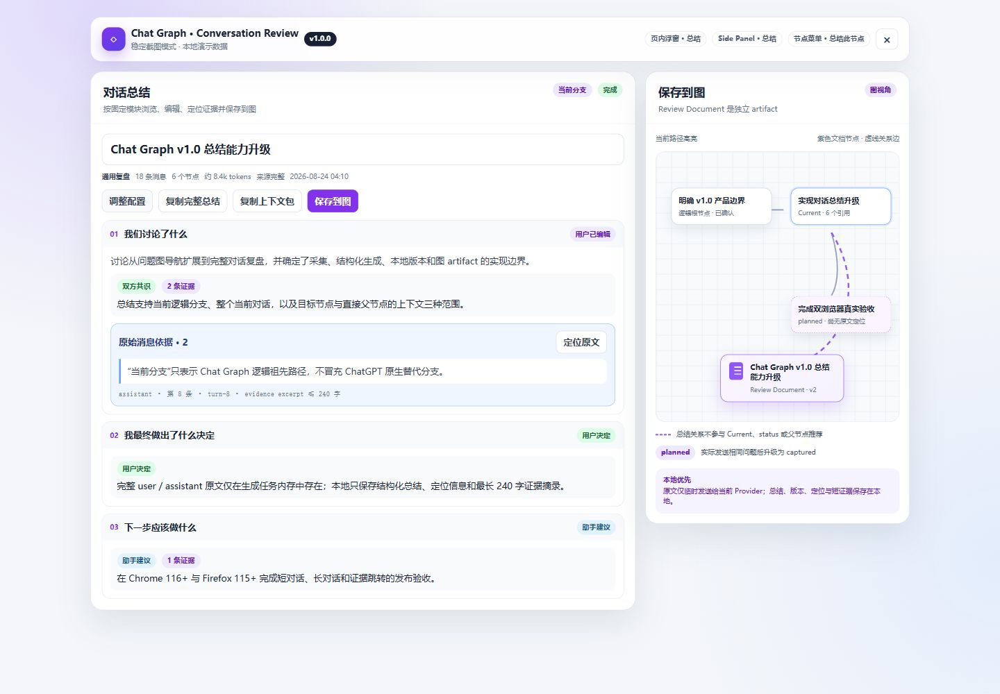

# Chat Graph v1.0.0 — 对话总结

v1.0.0 在 v0.13 引用感知问题图上加入可配置、可编辑、可追溯的对话总结。问题图仍负责导航讨论结构；总结使用独立的 Review Document artifact，不会伪装成 Question Node。

## 主要变化

- 三个统一入口：ChatGPT 页内浮窗顶部“总结”、Side Panel 项目工具栏“总结”，以及完整图/浮窗图节点菜单“总结此节点”。
- 三种范围：当前分支、整个当前对话、当前节点及上下文。
- 33 个总结模块，按常用内容、决策复盘、学习与理解、项目落地、对话建图五组固定排序。
- 5 个预设：通用复盘、技术项目、学习答疑、决策复盘、继续对话；手动修改模块后显示“自定义”。
- 结构化结果：模块概览和条目、结论状态、系统推断/用户编辑标记、证据抽屉与来源定位、分支建议。
- 编辑与交付：标题/模块编辑、最多 20 次编辑撤销、恢复模型原稿、模块/完整复制、单模块重试、Markdown、上下文包、本地反馈和保存到图。
- 版本管理：更新原总结会追加不可变版本；创建独立版本会生成新的总结 artifact 并记录前序关系。来源 Hash 变化后旧总结显示“已有后续消息”，不会被自动改写。

## 范围语义

- **当前分支**：当前节点到 Chat Graph 逻辑根节点的祖先路径，以及路径节点对应的完整 turn。
- **整个当前对话**：当前 `chatId` 页面可采集的全部 user / assistant 消息，并附加同会话图节点的路径 metadata。
- **当前节点及上下文**：目标节点和直接父节点的完整 turn；更早祖先只使用已有 question 或短 summary 作为必要上下文。

范围预览会显示消息数、节点数、是否跨逻辑分支、估算长度、处理策略和缺失来源。来源缺失时默认禁止完整生成；只有用户明确确认后，才允许生成带明显缺失标记的部分结果。

v1.0 中的“分支”只表示 Chat Graph 的逻辑路径，不实现 ChatGPT 编辑或重新生成产生的原生替代分支。未激活的原生替代分支不会被标成已采集内容。

## 长对话与任务

- 语言感知估算会为 JSON 和 Prompt 增加余量。较短输入且模块不超过 10 个时一次请求生成。
- 其他输入按约 10k token 分段并保留相邻两条消息上下文；事实只提取一次，随后每批最多生成 6 个模块。
- 最多处理 20 段；再长的范围会被阻止，并建议缩小范围。
- 分段或模块失败时保留成功结果、记录缺失消息区间并允许重试。
- 任务状态包括等待、采集、整理、生成、完成、部分完成、已取消、失败和已中断。
- 关闭配置或结果界面不会取消活动任务。浏览器或 MV3 Worker 重启会将未完成任务标为“已中断”；由于来源原文不持久化，必须重新采集后才能重试。

## 数据与隐私

- 对话总结只在用户主动开始生成时读取并发送所选范围内的 user / assistant 原文。
- 原文直接从扩展发送到用户配置的 AI Provider，仅存在于任务内存；完成、取消或失败后释放，不写入 IndexedDB、日志或 JSON 备份。
- 本地持久化结构化总结、不可变版本和当前编辑稿、任务 metadata、消息定位，以及每条最长 240 字的证据摘录。
- “AI 父节点推荐”开关只控制自动父节点推荐；手动总结仍可使用，但会在发送前校验当前 Provider、模型、API Key 和 HTTPS 域名权限。
- “有帮助/没帮助”和模块问题反馈只保存在本地，不发送到项目维护者或分析服务。
- JSON 备份升级到 schema v3，包含总结 artifact、版本、图关系和短证据摘录，兼容导入 v1/v2；不包含 AI 设置、API Key 或完整总结来源。

完整说明见 [隐私政策](../../PRIVACY.zh-CN.md)。

## 图与建议分支

- 总结在完整图和浮窗图中显示为紫色文档节点，通过虚线关系边连接默认或用户选择的锚点。
- 总结 artifact 不参与 Current、问题状态、父节点推荐或 Question Node 原文定位。
- 采用总结中的分支建议会创建显式 `planned` 问题节点。它在实际发送前没有原文定位；用户之后发送相同的规范化问题时会升级并绑定真实消息，避免重复节点。

## 兼容性与安装

- Chrome 116+
- Firefox 115+
- 本地开发和 CI：Node.js 22（仓库要求 22.22.2+）

发布包名称：

- `chatgpt-discussion-map-1.0.0-chrome.zip`
- `chatgpt-discussion-map-1.0.0-firefox.zip`

## 发布验收说明

仓库 CI 使用 Node.js 22 执行 `npm ci` 和 `npm run check`；后者包含 TypeScript 检查、自动化测试及 Chrome/Firefox MV3 生产构建。CI 成功不代替真实浏览器验收。

正式发布前仍应在 Chrome 116+ 和 Firefox 115+ 各执行一次短对话、多逻辑分支、超长对话和证据跳转测试，并记录实际结果。本发布说明不将尚未执行或未记录的人工测试描述为已通过。

## 已知边界

- ChatGPT DOM 或虚拟列表实现变化可能影响消息采集和证据定位。
- Side Panel 在目标会话没有打开时需要先打开来源会话再采集。
- 不提供联网事实核验、分支结束自动提示、自动 PRD/代码生成、云同步或外部任务系统。
- Markdown 默认不包含证据引用，用户可在导出时开启；导出始终使用当前编辑稿。
- 历史总结版本默认持续保留，直到用户删除总结或项目。
