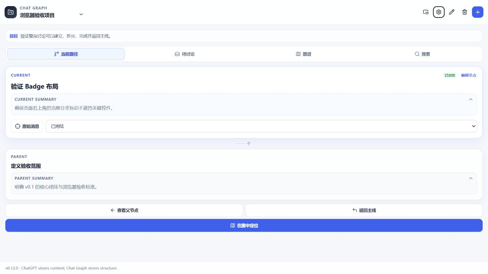
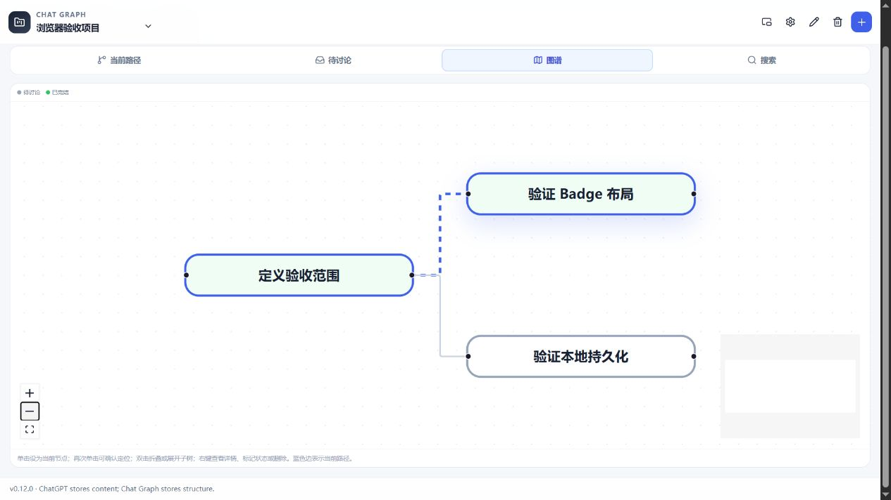
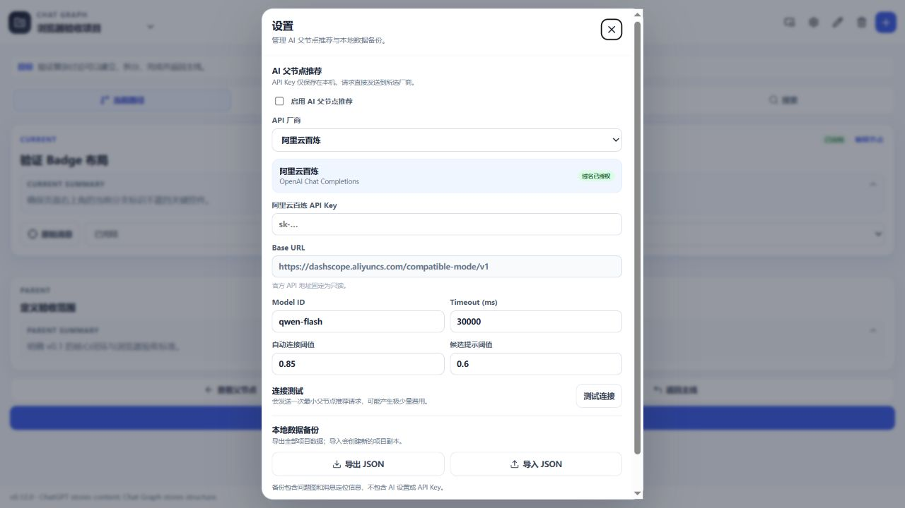
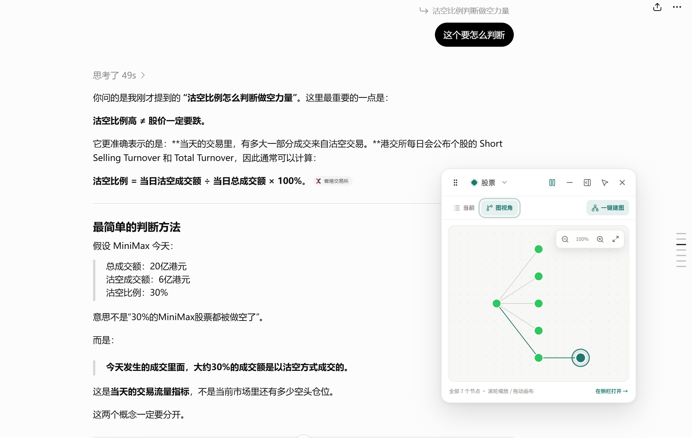

# Chat Graph v0.12.0 发布素材

本目录用于 GitHub Release 与项目介绍。截图不包含私人信息；前三张使用本地生产构建演示数据，浮窗效果图来自 ChatGPT 实际页面。

## 图标

- `icons/chat-graph-icon-1024.png`：主图标与 GitHub Release 素材
- `icons/chat-graph-icon-128.png`：大尺寸扩展图标
- `icons/chat-graph-icon-64.png`：中尺寸展示图标
- `icons/chat-graph-icon-32.png`：小尺寸展示图标

扩展 manifest 使用的 16 / 32 / 48 / 96 / 128 像素版本位于 `public/icon/`。

## 使用截图

### Current / Parent 工作区

### Question Graph

### 本地 JSON 备份

### ChatGPT 页面内浮窗

